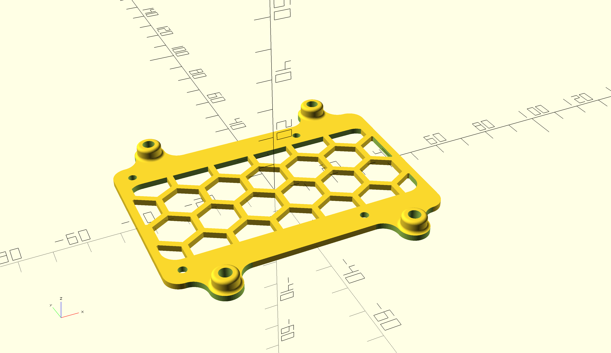
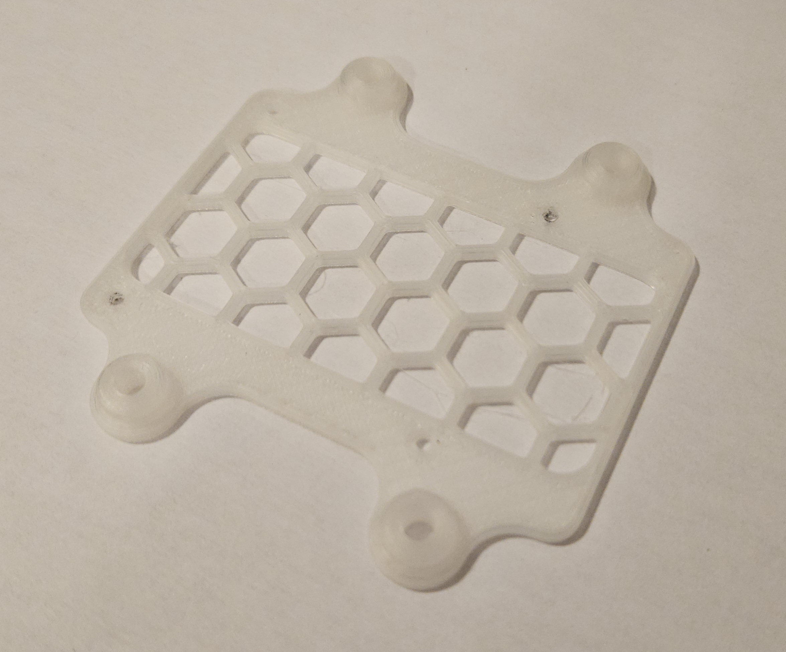
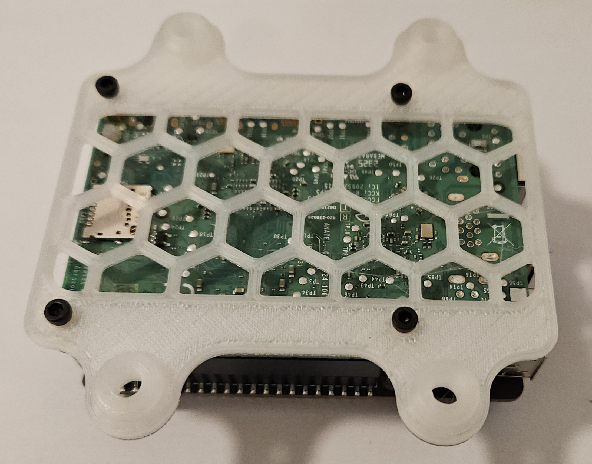
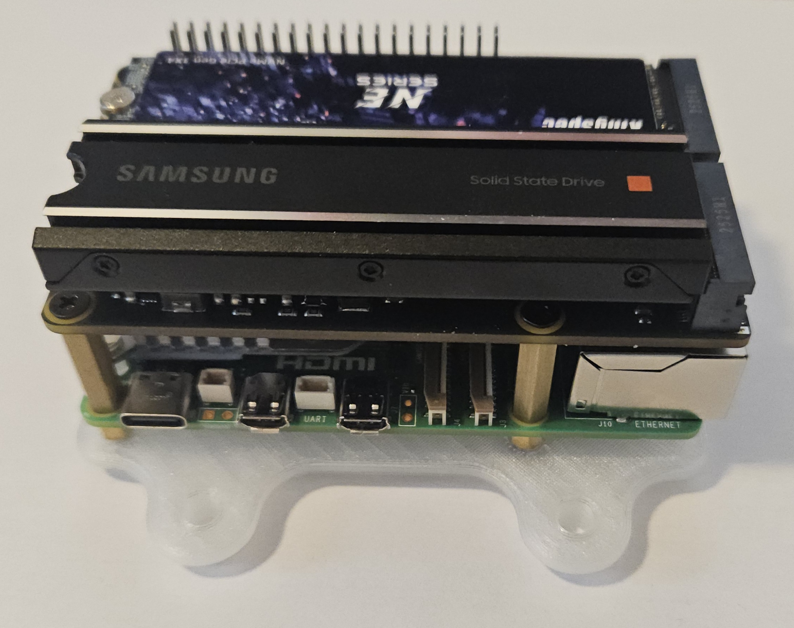
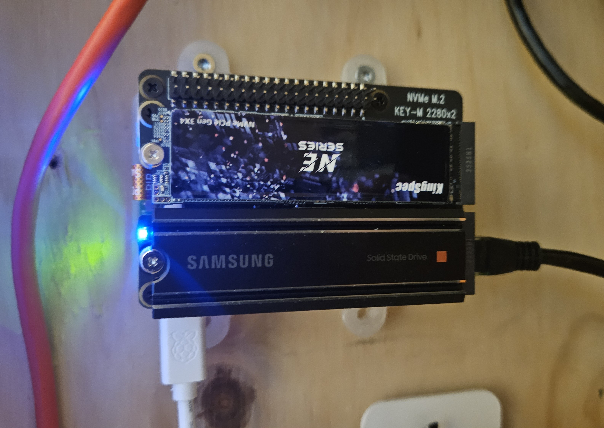

# Raspberry PI 4/5 wall adapter 

### Dependencies

*https://openscad.org/*

*https://en.wikibooks.org/wiki/OpenSCAD_User_Manual/Libraries*

- https://github.com/BelfrySCAD/BOSL2
- https://github.com/nophead/NopSCADlib

### Model

OpenSCAD

printed

### Install

